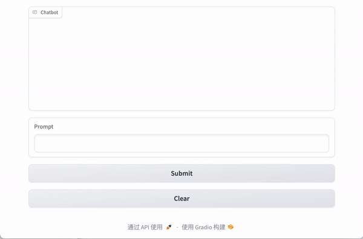
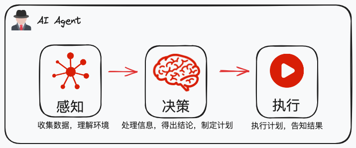

# langchain-samples

## Mini-AI-Agent

一个极简的、仅用 100 行代码构建的智能体应用。该应用能够根据用户问题，选择不同的工具获取信息，并生成最终回答，体现了智能体最核心的三步循环：感知-决策-行动。

### 什么是智能体？

**智能体（AI Agent）**是一种超越简单文本生成的人工智能系统，它使用大语言模型（LLM）作为其核心计算引擎，使其能够进行对话、推理、执行任务，展现一定程度的自主性。

在智能体架构中，核心功能可以归纳为三个步骤的循环：**感知-决策-行动**。智能体首先通过感知机制收集环境信息，然后基于该信息和预设目标，通过决策机制制定行动计划，最终通过动作执行机制实施这些计划。

*图：AI Agent架构示意*

应用解读： https://emacoo.cn/AI/mini-gpt-agent/
